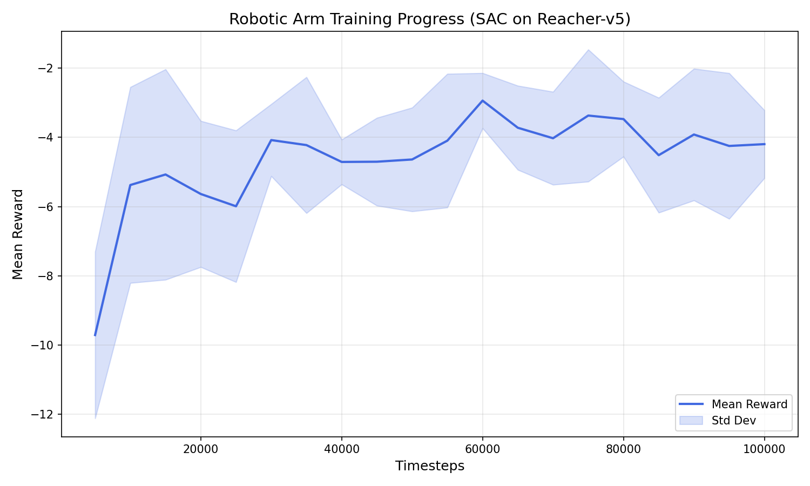

# 🤖 Robotic Arm Control with Reinforcement Learning

Training a robotic arm to reach targets using Soft Actor-Critic (SAC) 
reinforcement learning in MuJoCo simulation — no hardware needed!

## Demo


## Training Curve


##  Results
| Metric | Value |
|--------|-------|
| Algorithm | SAC (Soft Actor-Critic) |
| Environment | Reacher-v5 (MuJoCo) |
| Total Timesteps | 200,000 |
| Mean Reward | -3.33 |
| Std Dev | ±1.37 |

## Setup
```bash
conda create -n robotics python=3.10
conda activate robotics
pip install mujoco "gymnasium[mujoco]" stable-baselines3 matplotlib numpy
```

## 🚀 Run
```bash
# Train the model
python train_arm.py

# Evaluate
python evaluate_arm.py

# Watch trained arm
python watch_arm.py

# Record video
python record_video.py
```

## How It Works
The SAC agent learns by trial and error:
- **Observation** — joint angles, velocities, target position (10 values)
- **Action** — torque applied to each joint (2 values)
- **Reward** — how close the arm gets to the target

## Tech Stack
- Python 3.10
- MuJoCo
- Gymnasium
- Stable-Baselines3
- Matplotlib